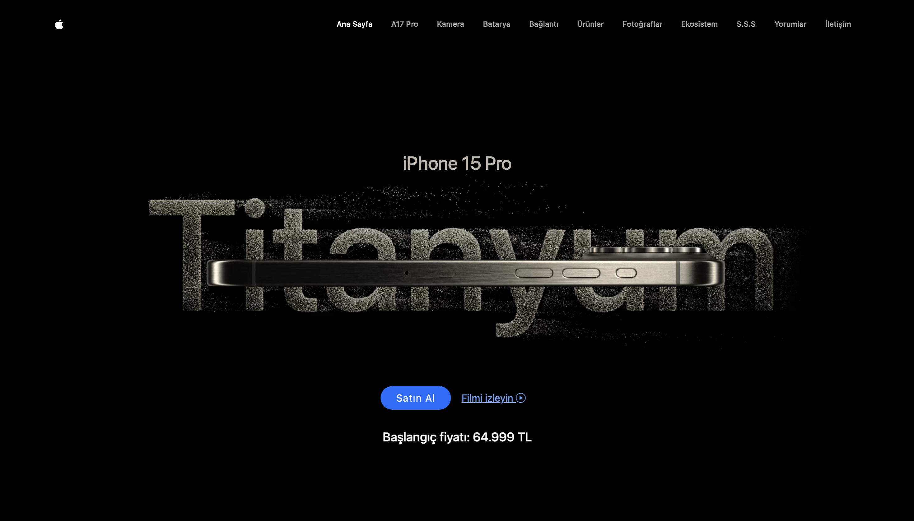

# Apple Webpage Clone

This is a responsive clone of the official Apple website, built using **Bootstrap**, **Swiper.js**, **Glightbox** and **AOS.js**. The goal of this project was to create a visually appealing, responsive design with smooth scrolling animations and a dynamic slider.

## Features
- **Fully Responsive:** Optimized for mobile, tablet, and desktop.
- **Glightbox Integration:** Videos play automatically and silently in a lightbox format.
- **Swiper.js Slider:** Interactive, responsive sliders for showcasing content.
- **AOS.js Animations:** Smooth, customizable scroll animations for enhanced user experience.

Visit the live demo [here](https://lustrous-douhua-7963d5.netlify.app).

## Screenshots

## Libraries and Technologies Used
- **HTML5**
- **CSS3**
- **Bootstrap 5**
- **Swiper.js** (for slider)
- **AOS.js** (for scroll animations)
- **Glightbox** (for video)
- **JavaScript**

## Credits
- Swiper.js: [Swiper.js](https://swiperjs.com/)
- AOS.js: [AOS.js](https://michalsnik.github.io/aos/)
- Glightbox: [Glightbox](https://biati-digital.github.io/glightbox/#specifications)

## License
This project is for educational purposes and does not intend to replicate Apple’s website for commercial use.
